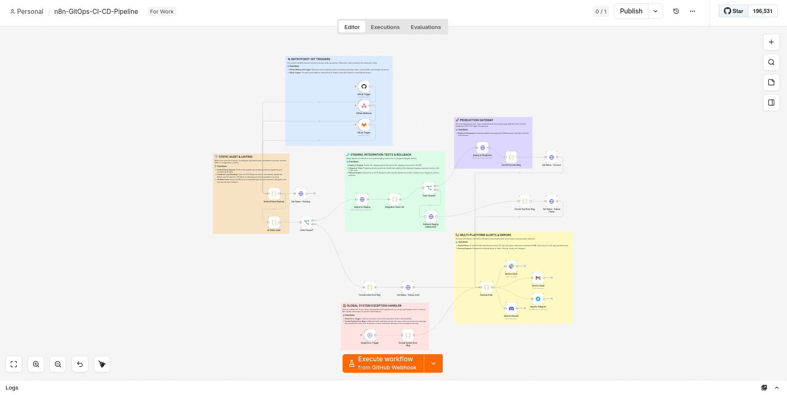

<h1 align="center">🚨 Enterprise n8n GitOps CI/CD Pipeline</h1>

<h3 align="center">Production-Grade Automated Linting, Staging Isolation, Integration Testing, Instant Rollbacks & Multi-Platform Alert Engine</h3>

<p align="center">
  
  
  
  
</p>

<p align="center">
  
</p>

---

## 📖 The Evolution: Moving from Manual Imports to Infrastructure as Code (IaC)

Manually copying and pasting JSON files or uploading raw workflows into production n8n environments is a massive threat to system stability. In a professional ecosystem, workflows are code—which means they must be version-controlled, programmatically audited, and tested in isolation before going live.

The **n8n GitOps CI/CD Pipeline PRO** turns your n8n workflows into a reliable, automated release lifecycle. When a developer pushes a workflow JSON to Git, this pipeline interceptor instantly takes over. It validates security compliance, deploys to a staging instance, runs programmatic health tests, triggers an automated rollback if the deployment breaks, and only promotes the changes to production when the build is proven to be 100% stable.

---

## 🏗️ Architectural Topology & Dual-Track Execution

The pipeline is split into logical stages protected by strict JavaScript validation gates. If a check fails at any point, the pipeline aborts deployment, updates the commit status on Git, and fires localized error alerts across all operational messaging tools.

```text
                             [ Git Webhook Trigger ]
                       (GitHub Push, GitLab Push, Webhook)
                                       │
                                       ▼
                           [ Verify & Parse Payload ]
                                       │
                ┌──────────────────────┴──────────────────────┐
                ▼ (Registers Build)                           ▼ (Executes Linting Engine)
       [ Set Status - Pending ]                       [ JS Static Linter ]
                                                              │
                                            ┌─────────────────┴─────────────────┐
                                            ▼ (Linter Fails)                    ▼ (Linter Passes)
                                ┌───────────────────────┐           [ Deploy to Staging ]
                                │ Set Status - Failure  │                       │
                                │ Format Linter Error   │                       ▼
                                └───────────┬───────────┘           [ Integration Tests (JS) ]
                                            │                                   │
                                            │                       ┌───────────┴───────────┐
                                            │                       ▼ (Tests Fail)          ▼ (Tests Pass)
                                            │           ┌───────────────────────┐   [ Deploy to Production ]
                                            │           │ Rollback Staging      │           │
                                            │           │ Set Status - Failure  │           ▼
                                            │           │ Format Test Error     │   [ Set Status - Success ]
                                            │           └───────────┬───────────┘   [ Format Success Msg ]
                                            │                       │                       │
                                            └───────────────────────┼───────────────────────┘
                                                                    ▼
                                                             [ Payload Prep ]
                                                                    │
                                         ┌──────────────────┬───────┴──────────┬──────────────────┐
                                         ▼                  ▼                  ▼                  ▼
                                   [ Send Slack ]     [ Send Gmail ]     [ Send Telegram ]  [ Send Discord ]

                                   [ Global Error Trigger ] ────► [ Format System Error ] ────► [ Payload Prep ]

```

---

## 🔍 Core Pipeline Phases & Engineered Node Logic

### 1. Verification & Security Payload Parsing

* **Webhook Authentication:** The `Verify & Parse Payload` node intercepts incoming JSON bodies. It is configured to run HMAC-SHA256 signature verification directly against headers to validate that payloads originate exclusively from trusted Git triggers.
* **Metadata Preservation:** It extracts repository names, commit hashes, target file paths, and normalized JSON structures to pass cleanly down the execution line without structural loss.

### 2. The JS Static Linter (Code Quality Gate)

Before any system resource is used, the workflow JSON enters the `JS Static Linter` Node. This node executes custom sandboxed JavaScript to enforce strict engineering guidelines:

* **Anti-Credential Leakage Rule:** It scans node configurations using specialized regex to prevent developers from hardcoding credentials directly into HTTP nodes instead of using n8n’s encrypted system credentials:
```javascript
const secretPatterns = [/api_key/i, /secret/i, /password/i, /"key":\s*\"[a-zA-Z0-9]{10,}\"/i];

```


* **Banned Node Type Policies:** It blocks hazardous nodes like Execute Command or SSH from sneaking into production environments to protect against arbitrary code execution exploits:
```javascript
const forbiddenTypes = ['n8n-nodes-base.executeCommand', 'n8n-nodes-base.ssh'];

```


* **Styling & Best Practices Naming Standards:** It forces developers to rename default generic nodes (`Code`, `HTTP Request`) to highly descriptive titles, dramatically improving team readability.

### 3. Isolated Staging Deployment & Automated QA Integration

* **Staging Promotion:** If the linter returns zero errors, the JSON is posted directly to the Staging API endpoint using the `Deploy to Staging` node.
* **Integration Tests (JS):** The pipeline programmatically checks the staging deployment's health:
```javascript
if (!stagingResponse) {
    errors.push('[TEST FAILED] Received no response from the Staging API.');
} else if (stagingResponse.error) {
    errors.push(`[TEST FAILED] Staging deployment failed: ${stagingResponse.error.message}`);
} else if (!stagingResponse.id) {
    errors.push('[TEST FAILED] Staging deployment did not return a valid workflow ID.');
}

```


* **Instant Rollbacks:** If the staging API flags the imported workflow structure as unstable, the `Rollback Staging Deployment` node instantly issues an automated `DELETE` HTTP call to purge the corrupt instance, protecting the staging workspace.

### 4. Git Status Feedback Loop

The pipeline continuously keeps developers updated inside their existing tools. Using GitHub's/GitLab's Commit Status API, the pipeline updates the commit marker in real-time with three distinct state evaluations:

* `state: pending` — Static analysis running.
* `state: success` — Successfully validated and promoted to Production.
* `state: failure` — Build rejected (Lint or Integration Test failure).

---

## ⚡ Multi-Platform Payload Prep & Delivery Engine

Instead of duplicating formatting actions across every messaging channel, the pipeline routes all final telemetry through a centralized `Payload Prep` node. This script-based central processing unit creates native payloads optimized for every target platform concurrently:

```javascript
// 1. Discord Embed Output (Color-Coded Status Cards)
const discordPayload = {
  embeds: [{
    title: "n8n GitOps CI/CD",
    description: rawContent,
    color: isSuccess ? 3066993 : 15158332 // Green / Red
  }]
};

// 2. Slack Block Kit Structure (Engineered Layout Blocks)
const slackPayload = {
  text: isSuccess ? `🚀 *Deploy Success*` : `🚨 *Deploy Blocked*`,
  blocks: [{
    type: "section",
    text: { type: "mrkdwn", text: rawContent }
  }]
};

// 3. Telegram HTML Format (Clean Markup Support)
const telegramPayload = {
  text: `<b>n8n GitOps Alert</b>\n\n${rawContent.replace(/\*\*/g, '<b>')}`,
  parse_mode: 'HTML'
};

// 4. Clean Responsive HTML Email Body (For Management & Auditing Updates)
const emailPayload = {
  subject: `[GitOps] ${isSuccess ? '✅ SUCCESS' : '❌ FAILED'} - ${repo} (${commit})`,
  html: `<div style="font-family: Arial; border: 1px solid #ddd; border-radius: 8px; padding: 20px;">...</div>`
};

```

---

## 🛡️ Global Engine Failure Interception

What happens if n8n runs out of memory, an API key suddenly expires, or a cloud provider rate-limits your pipeline? This workflow implements a resilient `Global Error Trigger` linked to `Format System Error Msg`.

If any system-level crash occurs, the handler captures the error footprint, halts executions gracefully, bypasses regular logic channels, formats an emergency payload, and alerts the platform engineering team instantly without causing a silent platform freeze.

---

## 🚀 Installation & Setup

Setting up your automated CI/CD pipeline is straightforward. Follow this step-by-step setup guide to get things running:

### Prerequisites

* **n8n Instance:** An active self-hosted or cloud instance running **n8n v1.0+** (with API access enabled).
* **Two Environments:** An isolated n8n **Staging** instance and a live **Production** instance.
* **Credentials:** You will need API keys or OAuth credentials for:
* **GitHub** Personal Access Token (PAT) with `repo:status` scopes.
* **n8n API Keys** for both Staging and Production environments (`X-N8N-API-KEY`).
* Webhook setup configurations for target notifications (Slack, Discord, Telegram, Gmail).


### Deploying the Pipeline

1. **Clone & Setup:** Place the cloned structure directly inside your workspace:
```bash
n8n-gitops-ci-cd-pipeline/
├── assets/
│   └── workflow-canvas.png
├── workflows/
│   └── n8n-gitops-ci-cd-pipeline.json
├── LICENSE
└── README.md

```


2. **Import JSON:** Log into your primary administrative n8n workspace, create a new blank canvas, select **Import from File** in the top right menu, and upload `workflows/n8n-gitops-ci-cd-pipeline.json`.
3. **Configure Endpoint Creds:** * Open the HTTP Request nodes (`Deploy to Staging`, `Rollback Staging Deployment`, and `Deploy to Production`) and link your staging/production API keys.
* Open the `Set Status` nodes and replace `YOUR_GITHUB_TOKEN` with your GitHub PAT.


4. **Link Communication Webhooks:** Fill out the Bot/API credentials in the **Send to Slack**, **Send to Discord**, **Send to Telegram**, and **Send to Gmail** nodes.
5. **Set Git Webhook:** Configure your Git repository's Webhook settings to point directly to the Webhook URL generated by the `GitHub Webhook` node inside n8n.
6. **Go Live:** Set the pipeline workflow switch to **Active**!
